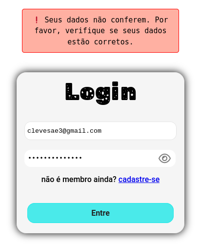
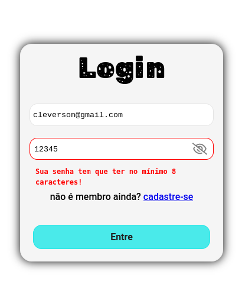
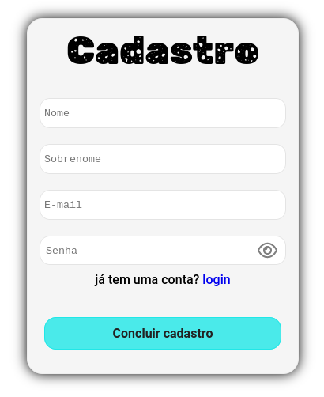
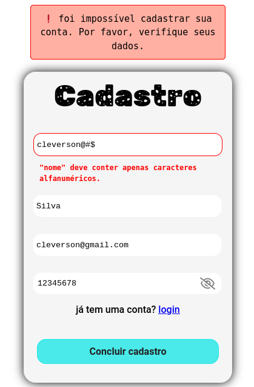
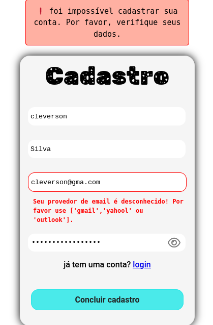
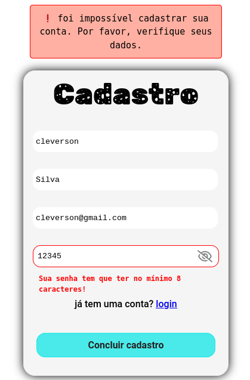
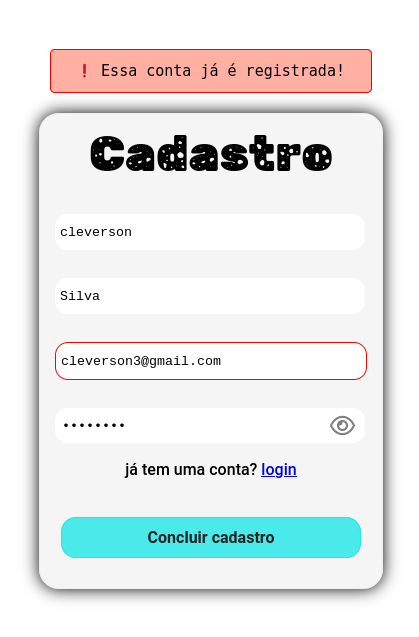

<h1>Uma Pagina de Login</h1>

Hello World pessoal 🖖

Esse é um projeto pessoal com a finalidade de treinar minhas abilidades no `HTML CSS` e `JavaScript`. 

* **Funcionalidades**

	* **página inicial**

	

	* **erros ao realizar o login**
	
	

	* **senha menor que 8 caracteres**
	
	

	* **página de cadastro**
	
	

	* **erro na caixa de input [nome]**
	
	

	* **erro na caixa de input [email]**
	
	

	* **senha menor que 8 caracteres**
	
	

	* **conta já registrada**
	
	

 > todos os dados de registro estão salvos no `local storage` do seu navegador.

 * **Link para o github pages:** [https://thisiscleverson.github.io/login-page/](https://thisiscleverson.github.io/login-page/) 

#

 	
<strong>Diário do projeto</strong>

	<strong>001:</strong> <a href="./src/001.md">Começando a pagina de login</a> 
	 
	<strong>002:</strong> <a href="./src/002.md">Uma nova página + novos estilos na página</a>
	 
	<strong>003:</strong> <a href="./src/003.md">botão mostrar/ocultar senha</a>
	 
	<strong>004:</strong> <a href="./src/004.md">criando o script do cadastro</a>
	 
	<strong>005:</strong> <a href="./src/005.md">script de avisos</a>
	

