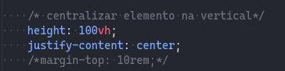
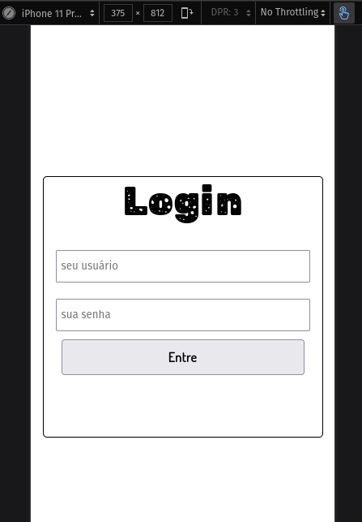
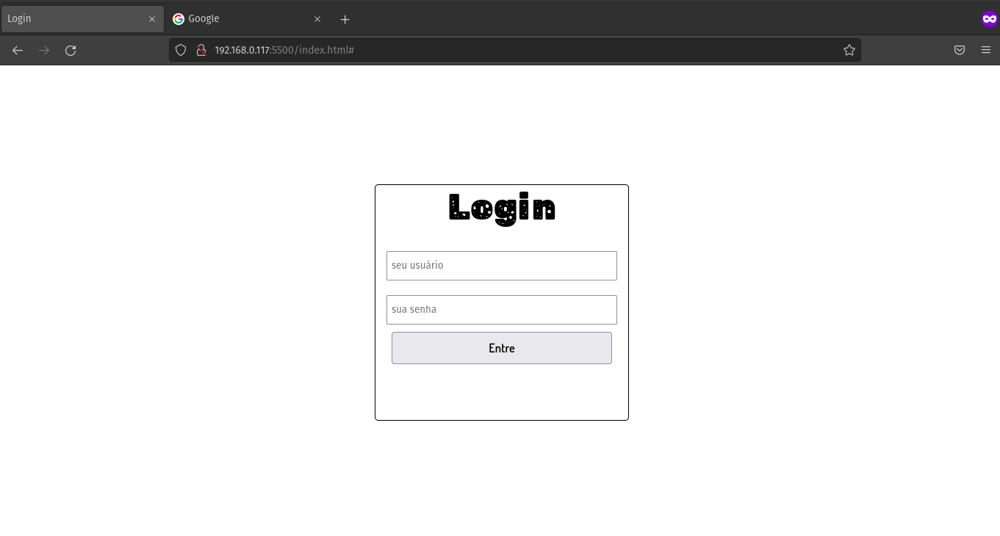

<h1>Começando a pagina de login!!!</h1>

<strong>02/07/22</strong>

Hoje eu decidir que iria criar uma pagina de login para poder treinar minhas abilidade no <code>HTML</code>  <code>CSS</code>  <code>JS</code> (que são poucas hahahah).

bem, como sou iniciante na área do <code>Front-end</code> e não tenho conhecimento amplo do <code>CSS</code> eu acabei encontrando alguns desafios no meio do caminho! Mas com força de vontade para buscar novos conhecimentos e acabar com esses desafios. Bem... Meu primeiro desafio foi:

* **Desafio 1**: Como centralizar um elemento na vertical?
	Bem, como eu disse na introdução do texto, eu sou iniciante no <code>CSS</code>, e eu não sabia como centralizar um elemento na vertical com a tela responsiva. E isso era um desafio para mim! Então eu fui atrás de aprender como centralizar um elemento na vertical, e olha, encontrei um artigo com várias forma de centralizar elementos. Então fui testando a funcionalidade de cada função e vendo como se comportava. E achei um modo que me atendia e poderia resolver meu problema.
	
	
	
	Na imagem a cima, eu usei essas linhas de códido para centralizar meu elemento. 
	
	1. Em primeiro lugar definir que a altura iria oculpar 100% da <code>viewport</code> com isso poderia usar o comando: 
		<code>justify-content: center</code> para centralizar a caixa de login na vertical.
		
		
		

		
		
		
		
		
	
* *Desafio 1 resolvido. Então vou continuar minha saga em terminar esse projeto que está me trasendo muitos conhecimentos na áreia de desenvolvimento.*
	