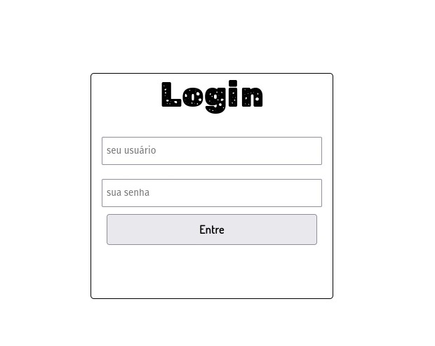
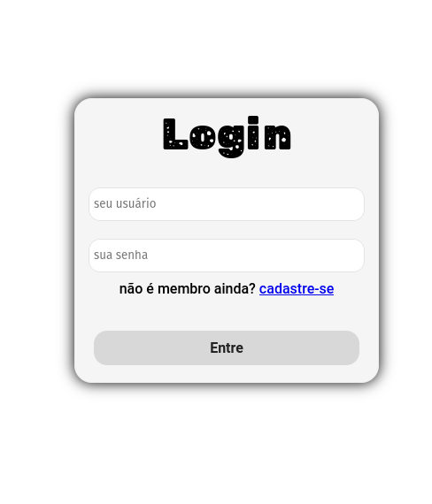
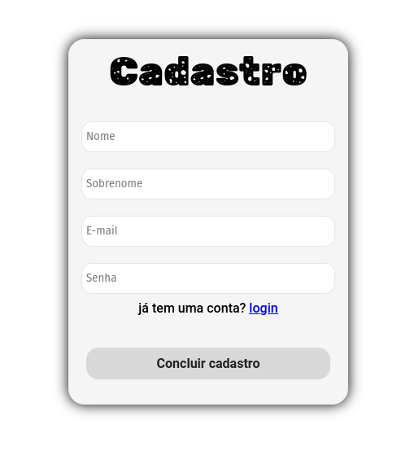

<h1>Uma nova página + novos estilos na página</h1>

<strong>04/07/22</strong>

Vida longa e prospera 🖖.

Hoje é dia de novidades! Não imaginava que esse mini projeto, mesmo sendo besta, taria muito conhecimento na área do <code>Front-end</code>. E eu estou desenvolver isso.

Mas, vamos no que interessa. Hoje eu adicionei novos estilos na pagina de login, coisas simples, como: 
1. uma sombra em volta da caixa de login usando <code>box-shadow</code>.
2. novas variaveis <code>CSS</code> no arquivo <a href=".././style/base.css">base.css</a>.
3. Um link para página de cadastro.

**Antes:**

**Depois:**

* Também criei uma página para cadastro. Foi bem simples. Eu só adicionei novos input e mudei o tamanho da caixa.
	**Resultado:**
	
	
	

	Eu gostei muito do resultado de como ficou a página de cadastro 😄
	
> Outro ponto importante é que eu adicionei a página de login no github pages, agora o pessoal vai poder interagir com a página.

**link para o github pages:  [https://thisiscleverson.github.io/login-page/](https://thisiscleverson.github.io/login-page/) **

---
❗Por em quanto estou focado em desenvolver só o front-end da página.
---
